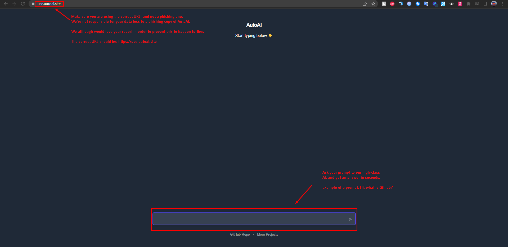

# 💡 How do I use it?


**Quick tip:** You can click the image in order to read the text in it. This is important information you'll need.



## AutoAI overview

Got a minute? Check out a screenshot overview of our product:

<figure><figcaption></figcaption></figure>

Make sure you are using the correct URL, and not a phishing one. Unfortunately, We're not responsible for your data loss to a pishing copy of AutoAI or ChatGPT.

We although would love your [report ](https://report.autoai.site)in order to preventt this to happen further.

The correct URL of the page should be: [https://use.autoai.site\
](https://use.autoai.site)

After scrolling down, you'll see a little chatbar. Ask your promt there to our high-class AI and get an answer within seconds. \
\
An proper exmaple of a prompt would be: \
<mark style="color:red;">"Hi, what is a documentation's purpose?"</mark>\ <mark style="color:red;">"Hi, what is Github?"</mark>

